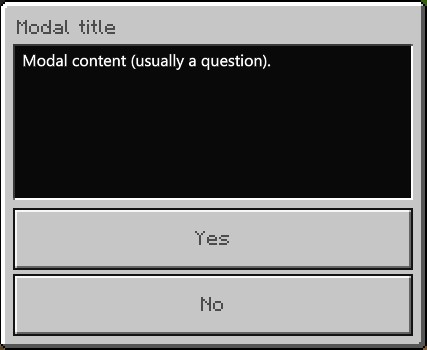
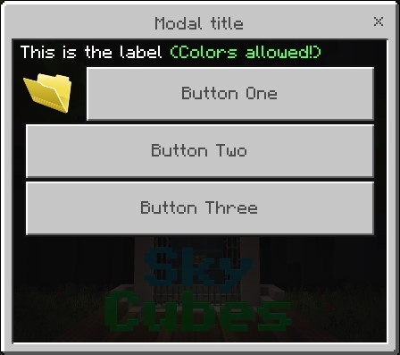
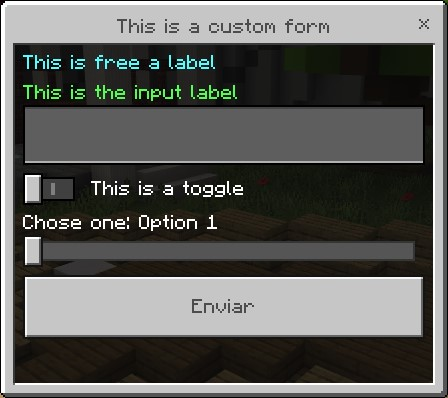
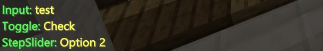

# SkyForms
Form support to SkyCube plugins

### How to use:

```php
// Add $skyforms attribute to class
// Put SkyForms plugin instance to $skyforms attribute:
$this->skyforms = $this->getServer()->getPluginManager()->getPlugin("SkyForms");
```

### Creating Modal Form:
```php
$formTitle = "Modal title";
$formContent = "Modal content (usually a question).";
$btnYes = "Yes"; // Positive button text (optional)
$btnNo = "No"; // Negative button text (optional)
$form = $this->skyforms->createModalForm($formTitle, $formContent, $btnYes, $btnNo);

$form->sendTo($player, function($response) use (&$player){ // Where '$player' is a instance of \pocketmine\Player
  // Yes button results in (bool)$response = true
  // No button results in (bool)$response = false
  if($response){
    $player->sendMessage("You chose YES");
  }else{
    $player->sendMessage("You chose NO");
  }
});
```


### Creating Menu Form
```php
$formTitle = "Modal title";
$formLabel = "This is the label §a(Colors allowed!)";
$form = $this->skyforms->createMenuForm($formTitle, $formLabel);
// Images can be added in 2nd parameter (URL/Path)
$form->addButton("Button One", "https://www.awicons.com/free-icons/download/folder-icons/vista-folder-icons-by-lokas-software/png/128/000400-folder.png");
$form->addButton("Button Two");
$form->addButton("Button Three");

$form->sendTo($player, function($response) use (&$player){ // Where '$player' is a instance of \pocketmine\Player
  switch($response){
    case 'Button One':
      $player->sendMessage("You pressed the 1st button.");
      break;
    case 'Button Two':
      $player->sendMessage("You pressed the 2nd button.");
      break;
    case 'Button Three':
      $player->sendMessage("You pressed the 3rd button.");
      break;
  }
});
```


### Creating Custom Form
```php
$formTitle = "This is a custom form";
$form = $this->skyforms->createCustomForm($formTitle);
// Custom form elements are created from functions

$form->addLabel("§bThis is free a label");
$form->addInput("§aThis is the input label");
$form->addToggle("This is a toggle", false); // bool in 2nd param to make it checked or not

// StepSliders returns value with array key, so create a array to translate it to text value
$options = array("Option 1", "Option 2");
$form->addStepSlider("Chose one", $options);

$form->sendTo($player, function($response) use (&$player, &$options){ // refer variables to use in Closure
  $player->sendMessage("§aInput: §e". $response['§aThis is the input label']); // if the input was created with colors, then use colors to get the result
  $player->sendMessage("§aToggle: §e". ($response['This is a toggle'] ? "Check" : "Uncheck"));
  $player->sendMessage("§aStepSlider: §e". $options[$response['Chose one']]); // array key to value
});
```



##### This plugin use [Frago's EasyForm code base](https://github.com/Frago9876543210/EasyForms)
